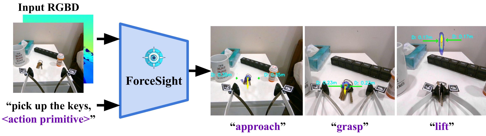
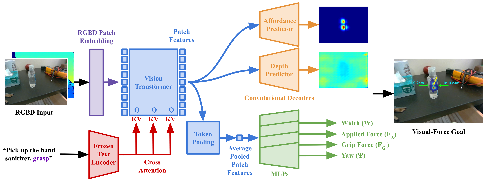

# ForceSight

Given an RGBD image and a text prompt, ForceSight produces visual-force goals for a robot, enabling mobile manipulation in unseen environments with unseen object instances.

[Project Page](https://force-sight.github.io/) | [Paper](https://arxiv.org/abs/2309.12312)




## Installation

Install the conda environment `forcesight`

```bash
conda env create -f environment.yml
conda activate forcesight
````

OR

(Optional) Manually install the dependencies:

```bash
# First create a conda environment
conda create -n fs python=3.8
conda activate fs
```
If manually installing dependencies, install PyTorch from [here](https://pytorch.org/get-started/locally/), then:
```bash
conda install libffi
pip3 install -r requirements.txt
```

## Quick Start

The following is a quick start guide for the project. The robot is not required for this part.

1. Download the dataset, model, and hardware [here](https://1drv.ms/f/s!AjebifpxoPl5hO5bu91QCJSDizws9g?e=h9AlnZ). Place the model in `checkpoints/forcesight_0/` and place the dataset in `data/`.

2. **Train a model**

    Skip this if using a trained checkpoint

    ```bash
    python -m prediction.trainer --config default_config
    ```

3. **Evaluate the prediction**
    ```bash
    python -m prediction.view_preds \
        --config default_config \
        --folder data/test_new_objects_and_env \
        --index 0 --epoch best --ignore_prefilter
    # --ignore_prefilter is used to ignore the prefiltering step, for faster init
    ```

    You will seen the output plot like this:
    
    

4. **Show live view**

    This requires a [realsense d405](https://www.intelrealsense.com/depth-camera-d405/) camera.

    ```bash
    python -m prediction.live_model --config default_config --index 0 --epoch best --prompt "pick up the keys"
    ```

    Press "p" to change the prompt. For more info about the key control, please refer to [keyboard_teleop](https://github.com/force-sight/forcesight/blob/5e2720016f31da6823b3eadfaaeaa7105803b588/robot/robot_utils.py#L140)

---

Beyond this point, the Documentation contains more detailed information about the project. This will involve the usage of the [Stretch](https://hello-robot.com/stretch-2) robot and the [Realsense D405](https://www.intelrealsense.com/depth-camera-d405/) camera.

## Data collection

We assume that you have a Stretch Robot and a force/torque sensor mounted on the wrist of the robot. Hardware to mount an [ATI Mini45](https://www.ati-ia.com/products/ft/ft_models.aspx?id=mini45) force/torque sensor to the Stretch can be found [here](https://1drv.ms/f/s!AjebifpxoPl5hO5bu91QCJSDizws9g?e=h9AlnZ).

- Requires installation of stretch_remote:
```bash
git clone https://github.com/Healthcare-Robotics/stretch_remote.git
cd stretch_remote
pip install -e .
```

Run the stretch remote server on the robot:
1. `python3 stretch_remote/stretch_remote/robot_server.py`
2. `conda activate forcesight`
3. test data collection, `cd ~/forcesight`

```bash
# first task
# OUTPUT Folder format: <TASK>_frame_<STAGE1>_<STAGE2>
python -m recording.capture_data --config <CONFIG> --stage train --folder <OUTPUT FOLDER> --prompt "pick up the apple" --realsense_id <ID>

# stage 1-> 2
python -m recording.capture_data --config <CONFIG> --stage train --folder pick_up_the_apple_frame_1_2 --prompt "pick up the apple" --realsense_id <ID>

# stage 2 -> 3
python -m recording.capture_data --config <CONFIG> --stage train --folder pick_up_the_apple_frame_2_3 --prompt "pick up the apple" --realsense_id <ID>

# stage 3 -> 4
python -m recording.capture_data --config <CONFIG> --stage train --folder pick_up_the_apple_frame_3_4 --prompt "pick up the apple" --realsense_id <ID>
```

**Key control**:
 - `wasd` key: up down front back
 - `[]` key: robot base
 - `ijkl` keys: wrist
 - `h`: home
 - `enter`: switch step
 - `space`: save frame
 - `backspace`: delete
 - `/`: randomize the position of the end effector

We use a randomizer to quickly obtain varied data, in `robot/robot_utils.py`, `if keycode == ord('/')`. This speeds up the data collection process.

Data collection for grip force model
```bash
python3 -m recording.capture_grip_data --bipartite 0 --config grip_force_5_21 --folder grip_force_5_25_frame_0_0 --stage train --ip 100.99.105.59
```

### Load the new data

We will try to load the data with a loader to check the newly collected raw data.

```bash
python -m prediction.loader --config <CONFIG> --folder data/raw
```

## Train a model

Set up a config for each model. The config used for ForceSight is provided in [config/forcesight.yaml](https://github.com/force-sight/forcesight/blob/main/config/forcesight.yml). For more details, please refer to the config files in `configs/` directory.

Start the training:
```bash
python -m prediction.trainer --config <CONFIG>
```

## Train grip force model (OPTIONAL)

Since grip force measurement is not available from the robot, we train a grip force model to predict the grip force, given fingertip locations, motor effort, and motor position. A default model is provided in `grip_force_checkpoints/` directory.

**Grip force data collection**

`python -m recording.capture_data --config <CONFIG> --stage raw --folder grip_force_5_25 --realsense_id <ID> --bipartite 0`

**Train the grip force prediction model**

`python -m prediction.grip_force_trainer --config <CONFIG> --bipartite 0`

## Running ForceSight on a real robot

After training, we can run the model on the robot. We will use ForceSight to generate kinematic and force goals for the robot, and the low-level controller will then control the robot to reach the goals.

To run the robot, we will need to run `stretch_remote/stretch_remote/robot_server.py` on the robot, and then run the `visual_servo.py`. The `visual_servo.py` can be run on a different computer with a GPU, and communication is specified by the `--ip` argument.

```bash
python -m robot.visual_servo --config default_config --index 6 --epoch latest --prompt "place the object in the hand" --ip <ROBOT IP>
```

Test model with live view and visual servoing
```bash
# Visual Servo: Press 'p' to insert prompt,
# Press 't' to switch between view model and visual servoing mode
# add --ros_viz arg to visualize the 3d scene on rviz
python -m robot.visual_servo --config default_config --index 0 --epoch best --prompt "pick up the keys" --ip <ROBOT IP>
```

If you do not have a force/torque sensor, you can still run ForceSight on the robot by passing `--use_ft 0` as an arg. If running `visual_servo.py`, set `USE_FORCE_OBJECTIVE` to `False` to ignore forces. Note that performance will suffer without the use of force goals, however.

---

## Others

### Run Realsense camera

Util scripts to run aruco detection and visualize the point cloud.

```bash
# Run realsense camera
python utils/realsense_utils.py
python utils/realsense_utils.py --cloud

# Run aruco deteciont with realsense
python -m utils.aruco_detect --rs
```

### Run with ROS

To install rospy in conda env, run `conda install -c conda-forge ros-rospy`, ***make sure you are using Python 3.8 or follow this: https://robostack.github.io/GettingStarted.html

*Note: ROS tends to be unfriendly with conda env, so this installation will not be seamless.*

```bash
roslaunch realsense2_camera rs_camera.launch enable_pointcloud:=1 infra_width:=640

# view the point cloud
rviz -d ros_scripts/ros_viz.rviz

# then run the marker pose estimation script
python3 -m ros_scripts.ros_aruco_detect

# ros viz to visualize the pointcloud and contact in rviz. --rs to use realsense --ft to use ft sensor
python -m ros_scripts.ros_viz --rs
```

**Others**

ROS to visualize the urdf. URDF describes the robot model, and it is helpful to calculate the forward and inverse kinematics of the robot.

```bash
roslaunch ros_scripts/urdf_viewer.launch model:=robot/stretch_robot.urdf
```

Test joints of the robot

```bash
roslaunch ros_scripts/urdf_viewer.launch model:=robot/stretch_robot.urdf joints_pub:=false
python3 joint_state_pub.py --joints 0 0 0 0 0 0
```

Extra, to convert xacro to urdf from [stretch_ros](https://github.com/hello-robot/stretch_ros/tree/master/stretch_description/urdf), run:

```bash
rosrun xacro xacro src/stretch_ros/stretch_description/urdf/stretch_description.xacro -o output.urdf
```

### Test data augmentation
We tested various methods of data augmentation during pilot experiments.

```bash
python -m utils.test_aug --no_gripper --data <PATH TO DATA FOLDER>
python -m utils.test_aug --translate_pic  --data <PATH TO DATA FOLDER>
```

---

## Notes

1. There are some caveats when using D405 Camera with ROS. The current realsense driver doesnt support the D405 version, since the devel effort are in ros2. This fork is used: https://github.com/rjwb1/realsense-ros
2. Make sure that the image resolution is corresponding to the one its intrinsic parameters. Different image res for the same camera will have different ppx, ppy, fx, fy values. `rs-enumerate-devices -c`
3. To teleop the Stretch robot, use: https://github.com/Healthcare-Robotics/stretch_remote
4. if getting MESA driver error when running open3d viz in conda env, try `conda install -c conda-forge libstdcxx-ng`
5. There are 2 IK/FK solvers being used here: `kdl` and `kinpy`. Kinpy is a recent migration from KDL since kdl is dependent on ROS, which is a headache for conda installation.

## Bibliography

```bibtex
@misc{collins2023forcesight,
      title={ForceSight: Text-Guided Mobile Manipulation with Visual-Force Goals}, 
      author={Jeremy A. Collins and Cody Houff and You Liang Tan and Charles C. Kemp},
      year={2023},
      eprint={2309.12312},
      archivePrefix={arXiv},
      primaryClass={cs.RO}
}
```