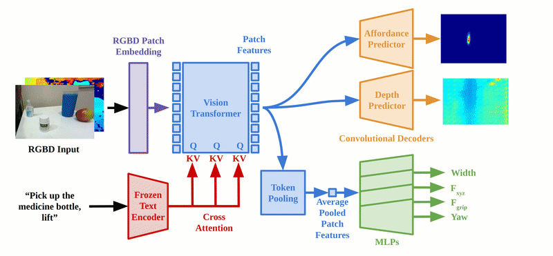
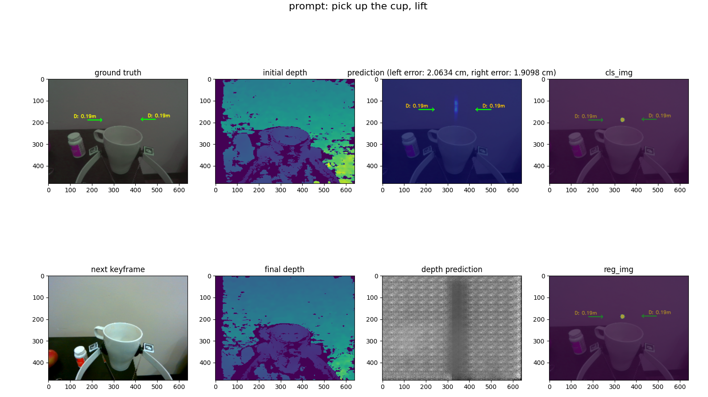

# ForceSight

Given an RGBD image and a text prompt, ForceSight produces visual-force goals for a robot, enabling mobile manipulation in unseen environments with unseen object instances. The project site is https://force-sight.github.io/. Our paper is available at [arxiv](https://arxiv.org/abs/2309.12312).



## Installations

1. Install the conda environment `forcesight`

```bash
conda env create -f environment.yml
conda activate forcesight
````

(Optional) Or manually install the environment and dependencies:

```bash
# First create a conda environment
conda create -n fs python=3.8
conda activate fs
```
Install pytorch from [here](https://pytorch.org/get-started/locally/), then:
```bash
conda install libffi
pip3 install -r requirements.txt
```


2. Then install `stretch_remote` for robot teleoperation:

```bash
git clone https://github.com/Healthcare-Robotics/stretch_remote.git
cd stretch_remote
pip install -e .
```

## Quick Start

This is a quick start guide for the project. The robot is not required for this part.

1. Download the dataset, model, and hardware [here](https://1drv.ms/f/s!AjebifpxoPl5hO5bu91QCJSDizws9g?e=h9AlnZ). Place the model in `checkpoints/default_config_0/` and place the dataset in `data/`.

2. **Train a model**

    Skip this if you plan to use trained checkpoint

    ```bash
    python3 -m prediction.trainer --config default_config
    ```

3. **Evaluate the prediction**
    ```bash
    python3 -m prediction.view_preds \
        --config default_config \
        --folder data/test_new_objects_and_env \
        --index 0 --epoch best --ignore_prefilter
    # --ignore_prefilter is used to ignore the prefiltering step, for faster init
    ```

    You will seen the output plot like this: 

4. **Show live view**

    This requires a [realsense d405](https://www.intelrealsense.com/depth-camera-d405/) camera.

    ```bash
    python3 -m prediction.live_model --config default_config --index 0 --epoch best --prompt "pick up the mouse"
    ```

    Click "P" to change the prompt. For more info about the key control, please refer to [keyboard_teleop](https://github.com/force-sight/forcesight/blob/5e2720016f31da6823b3eadfaaeaa7105803b588/robot/robot_utils.py#L140)

---

Beyond this point, the Documentation contains more detailed information about the project. This will involve the usage of the "Stretch" robot, and the "Realsense" camera.

## Data collection

We assume that you have a Stretch Robot and a force torque sensor mountecd on the wrist of the end effector.

- Requires installation of stretch_remote: https://github.com/Healthcare-Robotics/stretch_remote

Run stretch remote server
1. `python3 stretch_remote/stretch_remote/robot_server.py`
2. `conda activate forcesight`
3. test data collection, `cd ~/force-sight`

```bash
# first task
# OUTPUT Folder format: <TASK>_<DATE>_frame_<STAGE1>_<STAGE2>
python -m recording.capture_data --config data_collection_5_18 --stage raw --folder <OUTPUT FOLDER> --prompt "flip the switch" --realsense_id <ID>

# stage 1-> 2
python -m recording.capture_data --config data_collection_5_18 --stage train --folder flip_switch_5_24_frame_1_2 --prompt "flip the switch" --realsense_id <ID>

# stage 2 -> 3
python -m recording.capture_data --config data_collection_5_18 --stage train --folder flip_switch_5_24_frame_2_3 --prompt "flip the switch" --realsense_id <ID>

# stage 3 -> 4
python -m recording.capture_data --config data_collection_5_18 --stage raw --folder flip_switch_5_24_frame_2_3 --prompt "flip the switch" --realsense_id <ID>
```

** change raw to train when done

**Key control**:
 - `wasd` key: up down front back
 - `[]` key: left and right
 - `ijkl` keys: wrist
 - `h`: home
 - `enter`: switch step
 - `space`: save frame
 - `backspace`: delete
 - `/`: randomize the position of the end effector

We use a randomizer to change the random val, in `robot/robot_utils.py`, `if keycode == ord('/')`. This speeds up the data collection process.

Data collection for grip force model
```bash
python3 -m recording.capture_grip_data --bipartite 0 --config grip_force_dist_pos_effort_5_25 --folder grip_force_5_25_frame_0_0 --stage train --ip 100.99.105.59
```

### Load the new data

We will try to load the data with a loader to check the newly collected raw data.

```bash
python -m prediction.loader --config vit_xattn_meds_held_out_env_5_22 --folder data/raw
```

## Train a model

Set up a config for each model, an example is provided in [config/default_config.yaml](https://github.com/force-sight/forcesight/blob/main/config/default_config.yml). For more details, please refer to the config files in `configs/` directory.

Start the training:
```bash
python -m prediction.trainer --config <CONFIG FILE>
```

## Train grip force model (OPTIONAL)

Since grip force measurement is not available from the robot, we would train a grip force model to predict the grip force, from the input values of: fingertips location, motor effort and position. A default model is provided in `grip_force_checkpoints/` directory.

**Grip force data collection**

`python -m recording.capture_data --config grip_force_dist_pos_effort_5_25 --stage raw --folder grip_force_5_25 --realsense_id 130322272089 --bipartite 0`

**Train the grip force prediction model**

`python -m prediction.grip_force_trainer --config grip_force_dist_pos_effort_5_25 --bipartite 0`

## Running ForceSight on a real robot

After training, we can run the model on the robot. We will use `ForceSight` to generate kinematic and force goals for the robot, and the low-level controller will then control the robot to reach the goals.

To run the robot, we will need to run the `robot_server.py` on the robot, and then run the `visual_servo.py`. The `visual_servo.py` can be run on a different computer with a GPU, and the communication is specified by the `--ip` argument.

```bash
python3 -m robot.visual_servo --config default_config --index 6 --epoch latest --prompt "place the object in the hand" --ip 192.168.0.230
```

Test model with live view and visual servoing
```bash
# Visual Servo: Press P to insert prompt,
# hit key 'T' to switch between view model and visual servoing mode
# Configs: --ip 100.124.244.50 --use_ft 0
# add --ros_viz arg to viz the 3d scene on rviz
python3 -m robot.visual_servo --config default_config --index 0 --epoch best --prompt "pick up the mouse" --ip <ROBOTIP>
```

---

## Others

### Run Realsense camera

Util scripts to run aruco detect and visualize the point cloud.

```bash
# Run realsense
python3 utils/realsense_utils.py
python3 utils/realsense_utils.py --cloud

# Run aruco detect with realsense
python3 -m utils.aruco_detect --rs
```

### Run with ROS

To install rospy in conda env run `conda install -c conda-forge ros-rospy`, ***make sure you are using python3.8 or follow this: https://robostack.github.io/GettingStarted.html

*Note: ROS tends to be unfriendly with conda env, thus this installation will not be seamless.*

```bash
roslaunch realsense2_camera rs_camera.launch enable_pointcloud:=1 infra_width:=640

# view the point cloud
rviz -d ros_scripts/ros_viz.rviz

# then run the marker pose estimation script
python3 -m ros_scripts.ros_aruco_detect

# ros viz to visualize the pointcloud and contact in rviz. --rs to use realsense --ft to use ft sensor
python -m ros_scripts.ros_viz --rs
```

**Others**

ROS to visualize the urdf. URDF describes the robot model, and it is helpful to calculate the forward and inverse kinematics of the robot.

```bash
roslaunch ros_scripts/urdf_viewer.launch model:=robot/stretch_robot.urdf
```

Test joints of the robot

```bash
roslaunch ros_scripts/urdf_viewer.launch model:=robot/stretch_robot.urdf joints_pub:=false
python3 joint_state_pub.py --joints 0 0 0 0 0 0
```

Extra, to convert xacro to urdf from [stretch_ros](https://github.com/hello-robot/stretch_ros/tree/master/stretch_description/urdf), run:

```bash
rosrun xacro xacro src/stretch_ros/stretch_description/urdf/stretch_description.xacro -o output.urdf
```

### Test data augmentation

Data Aug was tested.

```bash
python3 -m utils.test_aug --no_gripper --data <PATH TO DATA FOLDER>
python3 -m utils.test_aug --translate_pic  --data <PATH TO DATA FOLDER>
```

---

## Notes

1. There are some caveats when using D405 Camera with ROS. The current realsense driver doesnt support the D405 version, since the devel effort are in ros2. This fork is used: https://github.com/rjwb1/realsense-ros
2. Make sure that the image resolution is corresponding to the one its intrinsic parameters. Different image res for the same camera will have different ppx, ppy, fx, fy values. `rs-enumerate-devices -c`
3. To teleop the robot, use: https://github.com/Healthcare-Robotics/stretch_remote
4. if getting MESA driver error when running open3d viz in conda env, try `conda install -c conda-forge libstdcxx-ng`
5. There's 2 IK/FK solver being used here: `kdl` and `kinpy`. Kinpy is a recent migration from KDL since kdl is dependent on ROS, which is nasty for conda installation.

## Bibliography

```bibtex
@misc{collins2023forcesight,
      title={ForceSight: Text-Guided Mobile Manipulation with Visual-Force Goals}, 
      author={Jeremy A. Collins and Cody Houff and You Liang Tan and Charles C. Kemp},
      year={2023},
      eprint={2309.12312},
      archivePrefix={arXiv},
      primaryClass={cs.RO}
}
```
